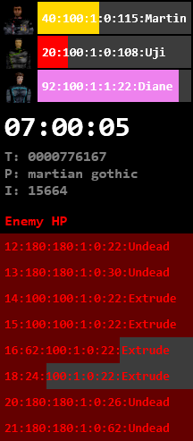

{{ site.product_name }} is a speedrun tool for the *popular* PC game [{{ site.game_name }}](https://en.wikipedia.org/wiki/Martian_Gothic:_Unification){:target="_blank" rel="noopener"}.

Last Update:  {%- assign date_format = site.minima.date_format | default: "%b %-d, %Y" -%} {{ post.date | date: date_format }} (Changelog).

## Installation

1. Download and extract the latest version of **[SRT Host](https://www.neonblu.com/SRT/){:target="_blank" rel="noopener"}**.
2. Download the latest **[{{ site.product_name }} Plugin Pack {{ site.github.latest_release.name }}]({{ site.github.repository_url }}/releases/download/{{ site.github.latest_release.tag_name }}/{{ site.github.repository_name }}-plugin-pack_{{ site.github.latest_release.name }}.zip)**.
3. Extract the Plugin Pack contents to SRT Host **plugins** folder.
4. Run **SRTHost32.exe** and start {{ site.game_name }}.

## Features

* Player health.
* Poison status.
* Caution/danger status.
* Enemy health.
* In-game timer.
* DirectX overlay.
* Customizable interface.
* JSON HTTP Server via **[SRTPluginUIJSON](https://github.com/Squirrelies/SRTPluginUIJSON/){:target="_blank" rel="noopener"}**.

### Planned

* Inventory display.
* Equipped item.
